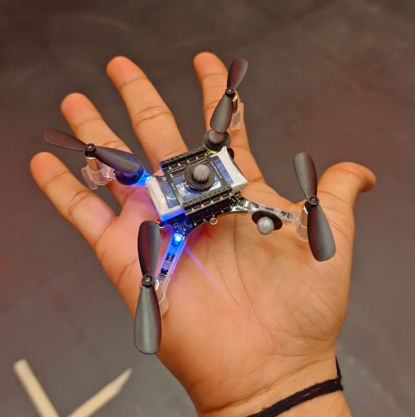
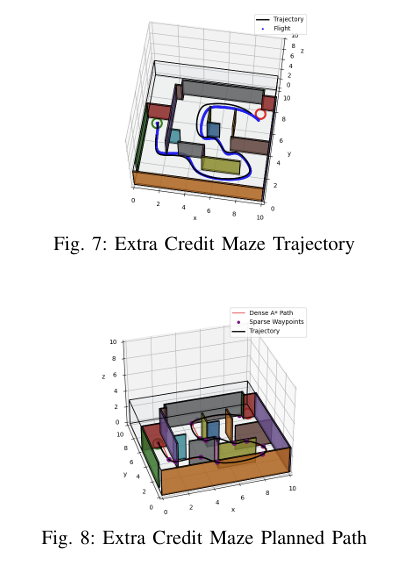
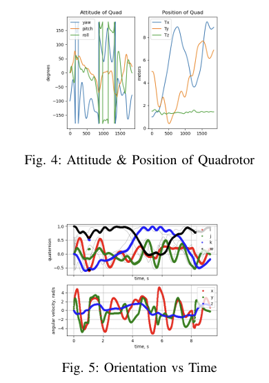
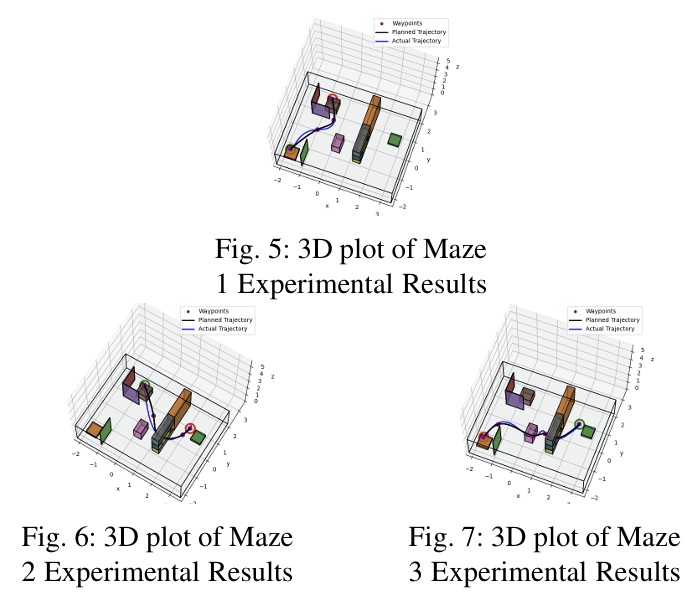
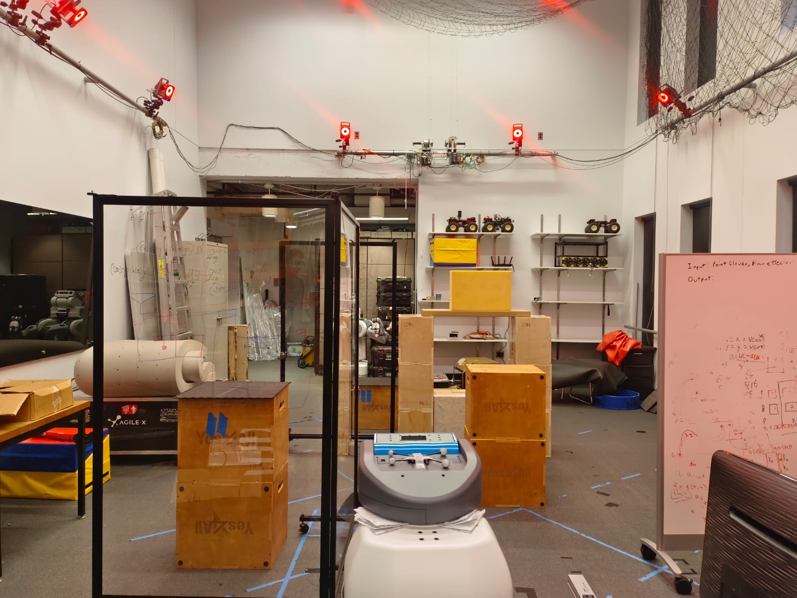
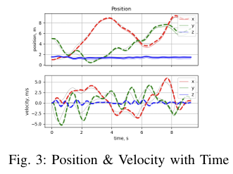

# 🚁 GPS-Denied Autonomy via Visual-Inertial Odometry for UAVs

> **Description**: A fully autonomous quadcopter system capable of GPS-denied navigation using Visual-Inertial Odometry (VIO). The pipeline integrates A* graph-search path planning, cubic-spline trajectory generation, an SE(3) geometric nonlinear controller, and a stereo-visual-inertial state estimator — validated on a real Crazyflie 2.0 with Vicon motion capture and stress-tested through six obstacle-filled simulation environments, including an extra local replanning module.

[](https://github.com)
[](https://www.python.org/)
[](https://www.ros.org/)

<div align="center">

**Full Autonomy Stack:**
Planning → Trajectory Generation → SE(3) Control → VIO State Estimation → (EC) Local Replanning

</div>

<div align="center">

<p float="left">

  
</p>

</div>


---

## 📋 Table of Contents

- [Overview](#-overview)
- [Key Features](#-key-features)
- [System Architecture](#-system-architecture)
- [Technical Approach](#-technical-approach)
  - [1. Path Planning (A\*)](#1-path-planning-a)
  - [2. Trajectory Generation](#2-trajectory-generation)
  - [3. SE(3) Geometric Controller](#3-se3-geometric-controller)
  - [4. Visual-Inertial Odometry](#4-visual-inertial-odometry)
  - [5. Local Replanning](#5-local-replanning)
- [Performance Results](#-performance-results)
- [Key Algorithms](#-key-algorithms)
  - [1. A\* on 3D Occupancy Grid](#1-a-on-3d-occupancy-grid)
  - [2. Cubic Spline Interpolation](#2-cubic-spline-interpolation)
  - [3. SE(3) Thrust & Moment Allocation](#3-se3-thrust--moment-allocation)
  - [4. Adaptive Safety Margin](#4-adaptive-safety-margin)
- [Hardware Validation](#-hardware-validation)
- [Lessons Learned](#-lessons-learned)
- [Future Improvements](#-future-improvements)
- [References](#-references)
- [Acknowledgments](#-acknowledgments)

---

## 🎯 Overview

This project builds a complete end-to-end autonomy stack for a quadcopter operating entirely without GPS. The system plans collision-free paths through cluttered 3D environments, generates dynamically feasible trajectories, tracks them with a nonlinear geometric controller, and estimates its own state from onboard IMU and stereo-feature measurements via Visual-Inertial Odometry — no external ground truth at runtime.

The controller was tuned and validated on a real Crazyflie 2.0 quadcopter inside a Vicon motion-capture lab, flying through physical 3D mazes. Those same gains and trajectory parameters were then carried directly into simulation, where the VIO estimator replaced the motion-capture oracle. The full closed-loop system was evaluated across six obstacle-filled maps. An extra-credit local-replanning module extends the system further, enabling online adaptation when new obstacles are discovered within a 5 m sensor horizon.

---

**Course**: MEAM 620 — Advanced Robotics  
**Institution**: University of Pennsylvania  
**Semester**: Spring 2025  
**Author**: Dhyey Shah  
**Hardware**: Crazyflie 2.0 + Vicon Motion Capture  
**Simulator**: flightsim (python based quadcopter simulator)

---

## ✨ Key Features

### 🔧 Core Capabilities

- ✅ **A\* Graph Search** on a 3D voxelised occupancy grid with 26-connected neighbours
- ✅ **Adaptive Safety Margin** that iteratively relaxes from 0.60 m → 0.10 m to guarantee path existence
- ✅ **Ramer–Douglas–Peucker (RDP) Sparsification** for waypoint reduction
- ✅ **Cubic Spline Trajectory** with clamped boundary conditions (C² continuity)
- ✅ **Velocity-Adaptive Time Allocation** based on segment length
- ✅ **SE(3) Geometric Nonlinear Controller** with decoupled thrust + moment allocation
- ✅ **VIO State Estimator** fusing stereo features and IMU
- ✅ **Hardware-Validated** on Crazyflie 2.0 with Vicon ground truth
- ✅ **Local Replanning** with collision-aware re-routing every 0.1 s

### 🎓 Advanced Techniques

- Orientation error on SO(3) via skew-symmetric extraction
- Quaternion ↔ rotation-matrix conversion at the controller boundary
- Covariance-trace monitoring for VIO health diagnostics
- Occupancy-snapping (`find_nearest_free_center`) for collision-safe waypoints
- Relative-time trajectory representation for seamless replanning

---

## 🏗️ System Architecture

```
┌─────────────────────────────────────────────────────────────────┐
│                     AUTONOMY PIPELINE                           │
│                                                                 │
│   ┌──────────┐   ┌──────────┐   ┌──────────┐   ┌────────────┐  │
│   │ OCCUPANCY│   │  A* PATH │   │TRAJECTORY│   │  SE(3)     │  │
│   │   MAP    │──▶│  PLANNER │──▶│   GEN    │──▶│ CONTROLLER │  │
│   └──────────┘   └──────────┘   └──────────┘   └─────┬──────┘  │
│                                                       │         │
│                                                       ▼         │
│   ┌──────────┐   ┌──────────┐   ┌──────────┐   ┌────────────┐  │
│   │  STEREO  │   │   IMU    │   │   VIO    │   │ QUADCOPTER │  │
│   │ FEATURES │──▶│ ACCEL/   │──▶│ STATE    │◀──│  DYNAMICS  │  │
│   └──────────┘   │  GYRO    │   │ ESTIMATOR│   └────────────┘  │
│                  └──────────┘   └─────┬────┘                   │
│                                       │  estimated state        │
│                                       └───────────────────┐     │
│                                                           ▼     │
│                                          feeds back to controller│
└─────────────────────────────────────────────────────────────────┘
                              │
                  ┌───────────┴───────────┐
                  │                       │
                  │   LOCAL REPLANNER     │
                  │                       │
                  │  • 5 m sensor horizon │
                  │  • 0.1 s replan cycle │
                  │  • Adaptive horizon   │
                  │    (7.5 m → 2.0 m)    │
                  └───────────────────────┘
```

### Module-Level Data Flow

```
                  ┌────────────────────┐
                  │   occupancy_map.py │
                  │  OccupancyMap()    │
                  └────────┬───────────┘
                           │  voxel grid
                           ▼
                  ┌────────────────────┐
                  │  graph_search.py   │
                  │  A* (26-neighbor)  │
                  └────────┬───────────┘
                           │  dense path
                           ▼
                  ┌────────────────────┐
                  │  world_traj.py     │
                  │  RDP → spline fit  │
                  └────────┬───────────┘
                           │  pos / vel / acc / jerk
                           ▼
                  ┌────────────────────┐
                  │  se3_control.py    │
                  │  u1 (thrust)       │
                  │  u2 (moments)      │
                  └────────┬───────────┘
                           │  motor commands
                           ▼
                  ┌────────────────────┐
                  │  Quadcopter / Sim  │
                  └────────┬───────────┘
                           │  IMU + stereo features
                           ▼
                  ┌────────────────────┐
                  │  vio.py            │
                  │  State Estimator   │
                  └────────────────────┘
                           │  estimated state
                           └──────────────────▶ (feeds back to controller)
```

---

## 🔬 Technical Approach

<div align="center">

<p float="left">

  
</p>

</div>

### 1. Path Planning (A\*)

#### Occupancy Grid Construction

The 3D environment is discretised into a voxel grid. Each voxel is marked occupied or free, with an inflatable **safety margin** around every obstacle. The margin starts conservatively wide and relaxes automatically if no path is found — this is critical for navigating tight corridors without manual per-map tuning.

```python
# occupancy_map.py — key parameters
resolution            = [0.2, 0.2, 0.2]   # metres per voxel
safety_margin_initial = 0.60              # metres
safety_margin_min     = 0.10              # metres
safety_margin_step    = 0.05              # metres (decrement on failure)
```

#### A\* Search

```python
# graph_search.py — pseudocode
def graph_search(world, start, goal, astar=True):
    """
    A* on a 26-connected 3D voxel grid.

    f(n) = g(n) + h(n)
      g(n): accumulated Euclidean cost from start
      h(n): Euclidean heuristic to goal (admissible)

    Neighbours: all 26 voxels in a 3×3×3 cube minus centre
    Cost edge: Euclidean distance between voxel centres
    """
    open_set  = PriorityQueue()   # (f, node)
    came_from = {}
    g_score   = {start: 0}

    while open_set:
        current = open_set.pop()
        if current == goal:
            return reconstruct_path(came_from, current)

        for neighbor in get_26_neighbors(current):
            if is_occupied(neighbor):
                continue
            tentative_g = g_score[current] + euclidean_dist(current, neighbor)
            if tentative_g < g_score.get(neighbor, inf):
                came_from[neighbor] = current
                g_score[neighbor]   = tentative_g
                f = tentative_g + heuristic(neighbor, goal)
                open_set.push((f, neighbor))

    return None   # no path found
```

**Adaptive Margin Loop** (called in `world_traj.py`):

```python
margin = 0.60
while margin >= 0.10:
    occupancy_map = OccupancyMap(world, resolution, margin)
    path = graph_search(world, start, goal)
    if path is not None:
        break
    margin -= 0.05   # relax and retry
```

This guarantees a path is found even in tight corridors, while preferring wider clearances when available.

#### Post-Processing

1. **RDP Simplification** (ε = 0.26 m for global planning; ε = 0.1 m for EC)
   - Removes collinear and near-collinear waypoints
   - Preserves macro geometry of the path
2. **Collinearity Check** (tolerance = 10⁻³)
   - Removes any remaining redundant inline points

### 2. Trajectory Generation

#### Velocity-Adaptive Time Allocation

Segment velocities are chosen based on distance to balance speed against control authority. Shorter segments — which tend to appear near turns and obstacles — are traversed more slowly, reducing overshoot on both hardware and under VIO noise.

| Segment Distance | Commanded Velocity |
|------------------|--------------------|
| > 3.2 m          | 4.2 m/s            |
| 1.2 – 3.2 m     | 3.2 m/s            |
| ≤ 1.2 m          | 2.2 m/s            |

```python
# world_traj.py — segment timing
def compute_segment_times(waypoints):
    t = [0.0]
    for i in range(1, len(waypoints)):
        dist = euclidean_dist(waypoints[i-1], waypoints[i])
        vel  = select_velocity(dist)   # table above
        t.append(t[-1] + dist / vel)
    return t
```

#### Cubic Spline Interpolation

A **clamped cubic spline** is fit independently along each axis (x, y, z):

```
s_i(t) = a_i + b_i(t − t_i) + c_i(t − t_i)² + d_i(t − t_i)³
```

**Continuity conditions enforced at every interior knot:**

| Condition    | Equation                              |
|--------------|---------------------------------------|
| Position     | s_i(t_i) = p_i                        |
| Velocity     | s_i′(t_i⁺) = s_{i-1}′(t_i⁻)         |
| Acceleration | s_i″(t_i⁺) = s_{i-1}″(t_i⁻)         |

**Boundary conditions** (clamped):
```
s′(t_0) = 0,   s′(t_N) = 0      (zero velocity at start and end)
```

#### Trajectory Evaluation (`update` method)

At query time *t*:

```python
def update(self, t):
    if t <= t_start:
        return p_start, [0,0,0], [0,0,0], [0,0,0], 0.0

    # Find active segment i such that t_i ≤ t < t_{i+1}
    dt = t - t_i

    pos  = [s_x(t), s_y(t), s_z(t)]
    vel  = [s_x′(t), s_y′(t), s_z′(t)]        # b + 2c·dt + 3d·dt²
    acc  = [s_x″(t), s_y″(t), s_z″(t)]        # 2c + 6d·dt
    jerk = [s_x‴(t), s_y‴(t), s_z‴(t)]        # 6d  (piecewise constant)
    yaw  = atan2(vel_y, vel_x)                 # heading tracks velocity

    return pos, vel, acc, jerk, yaw
```

### 3. SE(3) Geometric Controller

The controller operates directly on SE(3) — no Euler-angle singularities, no decomposition into cascaded position/attitude loops. Gains were tuned on real hardware and carried into the closed-loop VIO system without modification, demonstrating the robustness of the geometric formulation.

#### Position Loop → Desired Acceleration

```
r̈_des(t) = r̈_T − K_d(ṙ − ṙ_T) − K_p(r − r_T)
```

| Gain  | Value                    | Unit        |
|-------|--------------------------|-------------|
| K_p   | diag(3.75, 3.75, 30)     | 1/s²        |
| K_d   | diag(3.25, 3.25, 8.25)   | 1/s         |
| K_R   | diag(1500, 1500, 80)     | N·m/rad     |
| K_ω   | diag(100, 100, 20)       | N·m·s/rad   |

> **Note:** z-gains are significantly higher than x/y because altitude control does not require body tilt — there is no coupling to lateral dynamics. All gains were reduced ≈30 % from initial simulation values before the first hardware flight to account for aerodynamic uncertainties.

#### Thrust Allocation (u₁)

```python
# se3_control.py

F_des = m * r_ddot_des + np.array([0, 0, m*g])   # Newton's 2nd law
b3    = R @ np.array([0, 0, 1])                   # body z-axis in world
u1    = np.dot(b3, F_des)                         # scalar thrust
```

#### Desired Orientation Construction

```python
b3_des = F_des / np.linalg.norm(F_des)
a_psi  = np.array([cos(psi_T), sin(psi_T), 0])   # desired heading

b1_des = np.cross(b3_des, a_psi)
b1_des /= np.linalg.norm(b1_des)
b2_des = np.cross(b3_des, b1_des)

R_des  = np.column_stack([b1_des, b2_des, b3_des])
```

#### Moment Allocation (u₂)

```python
# Orientation error on SO(3)
e_R = 0.5 * vee(R_des.T @ R - R.T @ R_des)   # skew → vector

# Angular velocity error
e_w = omega - omega_des

# Commanded moments
u2 = I @ (-K_R @ e_R - K_w @ e_w)
```

Where `vee(·)` extracts the 3-vector from a skew-symmetric matrix.

### 4. Visual-Inertial Odometry

#### Sensor Model

In simulation, pre-generated stereo features are projected into the camera frame each timestep. The noise model is parameterised in `flightsim/sensors/vio_utils.py`:

| Sensor          | Noise Parameters                  |
|-----------------|-----------------------------------|
| Accelerometer   | noise density + random walk       |
| Gyroscope       | noise density + random walk       |
| Stereo features | σ_u, σ_v per pixel                |

All parameters are scaled by a single multiplier (e.g., ×0.01 for low-noise bench-testing; the autograder uses default values).

#### State Estimate → Controller

The VIO module (`vio.py`) outputs the full state vector: position, velocity, orientation (quaternion), and angular velocity. This feeds directly into the SE(3) controller, closing the autonomy loop entirely — no external ground truth is used at runtime.

#### Covariance Monitoring

The trace of the state-estimation covariance matrix is logged every iteration. A rising trace indicates degraded observability (e.g., feature-sparse regions) and can trigger conservative replanning in the EC module.

### 5. Local Replanning

#### Overview

Instead of committing to a single global trajectory, the EC planner continuously re-evaluates a **5 m local occupancy map** centred on the drone and replans every **0.1 s**, allowing the system to adapt to obstacles discovered online.

#### Key Design Decisions

| Parameter          | Global Planning | Local (EC)                  |
|--------------------|----------------|-----------------------------|
| Map scope          | Full environment | 5 m radius                 |
| Map resolution     | 0.2 m          | 0.1 m                       |
| Safety margin      | 0.60 → 0.10 m  | 0.38 → 0.20 m              |
| RDP ε              | 0.26 m         | 0.10 m                      |
| Planning horizon   | Full path      | 7.5 → 2.0 m (adaptive)     |
| Time reference     | Absolute       | Relative (t_rel = t − t₀)  |
| Collision check    | Once at plan   | Every 0.1 s                 |

#### Replanning Logic

```python
# world_traj.py (EC version) — pseudocode

def replan(current_state, global_goal):
    local_map = OccupancyMap(world, res=0.1, margin=current_margin)

    # Draw line toward global goal; pick local goal at horizon distance
    local_goal = find_local_goal(current_state.pos, global_goal, horizon)

    # A* on local map
    path = graph_search(local_map, current_state.pos, local_goal)
    if path is None:
        horizon -= 1.0            # shrink horizon, retry
        return

    # Snap waypoints to free voxels (post-RDP)
    path = [find_nearest_free_center(wp, local_map) for wp in path]

    # Build spline with relative time, initialised at current velocity
    self.trajectory = fit_spline(path, current_state.vel)
    self.traj_start_time = current_time
```

#### Collision-Detection Trigger

```python
while True:
    state = vio.get_state()
    if trajectory_nearly_complete(state) or collision_predicted(state):
        replan(state, global_goal)
    time.sleep(0.1)
```

---

## 📊 Performance Results

### Controller Step Response (z-axis)

| Metric                  | Measured | Target   |
|-------------------------|----------|----------|
| Commanded height        | 1.0 m    | 1.0 m    |
| Settled height          | 0.95 m   | 1.0 m    |
| Steady-state error      | 0.05 m   | 0 m      |
| Rise time (10%→90%)     | 0.7 s    | < 1.0 s  |
| Settling time           | 2.2 s    | < 3.0 s  |
| Overshoot               | ±0.03 m  | < 0.05 m |
| Estimated damping ratio | 0.65     | ≥ 0.7    |

> The 0.05 m steady-state offset is attributed to ground effect and unmodelled aerodynamic drag. An integral term would eliminate this.

### Maze Flight Tracking Errors

| Maze   | Max Position Error | Dominant Cause                  |
|--------|--------------------|---------------------------------|
| Maze 1 | ~0.1 m             | Low curvature — good tracking   |
| Maze 2 | ~0.5 m             | High curvature trajectory       |
| Maze 3 | ~0.1 m             | Low curvature — good tracking   |

> Tracking error scales directly with path curvature. Maze 2's aggressive turns produced deviations 5× larger than the near-straight mazes. The window passage was the most failure-prone location — reducing speed near it resolved collisions.

### Autonomous VIO Flights (6 Graded Maps)

All six graded maps were navigated safely. The pipeline required **zero algorithmic changes** when transitioning from ground-truth state to VIO — only import paths were updated.

| Component              | Status                                                  |
|------------------------|---------------------------------------------------------|
| Graph search (A\*)     | ✅ Robust across all maps                               |
| Trajectory generator   | ✅ Adaptive margins handled VIO noise automatically    |
| SE(3) controller       | ✅ Well-tuned gains absorbed estimation noise           |
| VIO estimator          | ✅ Sufficient accuracy for collision avoidance          |

The VIO covariance trace remained bounded throughout all maps. Brief spikes occurred when the camera faced feature-sparse walls, but observability recovered quickly.

### Local vs Global Planner (Maze Map)

| Metric           | Global (Vanilla) | Local (EC) |
|------------------|-----------------|------------|
| Planning time    | 0.9 s           | 1.5 s      |
| Flight time      | 9.3 s           | 10.0 s     |
| Flight distance  | 29.3 m          | 25.2 m     |

The EC planner trades ≈7 % more flight time for the ability to handle previously unknown obstacles within the sensor horizon.

---

## 🧮 Key Algorithms

### 1. A\* on 3D Occupancy Grid

**Input:** Voxelised world, start voxel, goal voxel  
**Output:** Shortest collision-free path (list of voxel centres)

**Complexity:** O(V log V) where V = number of free voxels  
**Neighbours:** 26-connected (full 3×3×3 cube minus centre)  
**Heuristic:** Euclidean distance (admissible + consistent → optimal)

```
f(n) = g(n) + h(n)

g(n) = cost from start to n (sum of edge lengths)
h(n) = ||n_pos − goal_pos||₂
```

**Edge cost:** Euclidean distance between voxel centres, naturally penalising diagonal moves (√2 or √3 times the resolution).

### 2. Cubic Spline Interpolation

**Input:** Waypoints p_0 … p_N with timestamps t_0 … t_N  
**Output:** C² smooth trajectory s(t)

Per-axis spline segment:

```
s_i(t) = a_i + b_i·Δt + c_i·Δt² + d_i·Δt³,   Δt = t − t_i
```

Coefficients solved via the standard tridiagonal system enforcing:
- Position interpolation at knots
- C¹ velocity continuity
- C² acceleration continuity
- Clamped endpoints: s′(t_0) = s′(t_N) = 0

**Derivatives (closed-form):**

| Quantity     | Expression                      |
|--------------|---------------------------------|
| Velocity     | b_i + 2c_i·Δt + 3d_i·Δt²       |
| Acceleration | 2c_i + 6d_i·Δt                  |
| Jerk         | 6d_i (piecewise constant)       |

### 3. SE(3) Thrust & Moment Allocation

**Position error → desired acceleration:**
```
r̈_des = r̈_ref − K_d·(ṙ − ṙ_ref) − K_p·(r − r_ref)
```

**Thrust (scalar):**
```
F_des = m·r̈_des + [0, 0, m·g]ᵀ
u₁   = b₃ᵀ · F_des,    where b₃ = R·[0,0,1]ᵀ
```

**Desired rotation:**
```
b₃_des = F_des / ||F_des||
b₁_des = (b₃_des × a_ψ) / ||b₃_des × a_ψ||
R_des  = [b₁_des  b₂_des  b₃_des]
```

**Orientation error (SO(3)):**
```
e_R = ½ · vee(R_desᵀ·R − Rᵀ·R_des)
```

**Moments:**
```
u₂ = I · (−K_R·e_R − K_ω·(ω − ω_des))
```

### 4. Adaptive Safety Margin

**Purpose:** Guarantee path existence even in tight corridors while preferring wider clearance.

**Algorithm:**

```
margin ← margin_initial          # 0.60 m
while margin ≥ margin_min:       # 0.10 m
    inflate obstacles by margin
    path ← A*(start, goal)
    if path found:
        return path
    margin ← margin − step       # 0.05 m
return FAILURE
```

**Analysis:** For a corridor of width *w*, the algorithm finds a path as long as *w* > 2 × margin_min + drone_radius. The iterative relaxation adds at most 10 extra A\* calls in the worst case.

---

## 🛸 Hardware Validation

<div align="center">

<p float="left">

  
</p>

</div>

### Lab Setup

| Component         | Details                                          |
|-------------------|--------------------------------------------------|
| Quadcopter        | Crazyflie 2.0 (ID printed on underside)          |
| Motion capture    | Vicon system (millimetre accuracy)               |
| Communication     | 2.4 GHz RF (Crazyflie ↔ desktop)                 |
| Control computer  | Lab desktop running ROS Noetic                   |

### Gain Tuning Sequence

```
1. Hover    →  confirm stability at z = const
2. Step z   →  tune K_p[z], K_d[z]  (no body tilt)
3. Step y   →  tune K_p[x,y], K_d[x,y]  (lateral)
4. Box      →  sign-off on evaluation waypoints
5. Maze     →  full 3D obstacle navigation
```

---

## 📚 Lessons Learned

### ✅ What Worked Well

1. **Modular Pipeline Design**
   - Each module (planner, trajectory, controller, estimator) was developed and tested independently, then assembled into a single directory.
   - Integration required zero algorithmic changes — only import paths were updated.
   - This validated the modularity approach for complex robotic systems.

2. **Adaptive Safety Margin**
   - The iterative margin relaxation elegantly handles the trade-off between safety and feasibility.
   - No manual tuning per map was required — the algorithm automatically finds the tightest feasible margin.

3. **Velocity-Adaptive Time Allocation**
   - Slowing down on short segments (near turns and obstacles) dramatically reduced tracking error and collision risk on both hardware and under VIO noise.

4. **Clamped Cubic Splines**
   - Zero-velocity boundary conditions ensured smooth takeoff and landing.
   - C² continuity kept acceleration bounded — critical for a quadrotor where acceleration maps directly to tilt angle.

### ⚠️ Challenges Encountered

1. **Sim-to-Real Gap**
   - Simulation gains were ≈30 % too aggressive for hardware.
   - Ground effect caused a persistent 0.05 m steady-state altitude error.
   - **Lesson:** Always reduce gains before the first hardware flight; consider adding an integrator for offset rejection.

2. **Curvature vs Tracking Error**
   - High-curvature trajectories produced large tracking errors on hardware.
   - The cubic spline minimises acceleration, not curvature — these are related but not identical.
   - **Lesson:** A curvature-aware trajectory optimizer would improve tracking.

3. **VIO Observability in Feature-Sparse Regions**
   - Covariance spikes when the camera faces featureless walls.
   - **Lesson:** Trajectory planning should avoid orientations that point the camera at blank surfaces.

4. **Resolution vs Narrow Gaps**
   - 0.2 m voxel resolution occasionally missed sub-voxel gaps.
   - **Lesson:** Adaptive resolution (coarser in open space, finer near obstacles) would balance speed and precision.

---

## 🔮 Future Improvements

### Short-Term

1. **Curvature-Aware Velocity Profiling**
   ```python
   # Reduce speed proportionally to local curvature κ
   v_max_local = v_max / (1 + alpha * kappa)
   ```

2. **Better Local-Goal Selection (EC)**
   ```python
   # Ray-march toward global goal; stop at first free voxel
   for t in np.linspace(0, horizon, N):
       candidate = lerp(current_pos, global_goal, t / dist_to_goal)
       if occupancy_map.is_free(candidate):
           local_goal = candidate
           break
   ```

### Medium-Term

4. **Model Predictive Control (MPC)**
   - Replace the open-loop spline + PD controller with a receding-horizon MPC.
   - Naturally handles input constraints (max thrust, max tilt angle).
   - Could be combined with the EC replanner for true online optimisation.

5. **SLAM Integration**
   - Add loop closure to the VIO module to eliminate drift over long trajectories.
   - Store a persistent map for revisiting previously explored areas.

---

## 📖 References

### Course Materials

1. MEAM 620 Lecture Notes — University of Pennsylvania, Spring 2025
2. MEAM 620 Assignment Specifications

### Hardware

3. Bitcraze, "Crazyflie 2.0 — Getting Started." https://www.bitcraze.io/documentation/tutorials/getting-started-with-crazyflie-2-x/
4. Vicon Motion Capture System Documentation. https://www.vicon.com/

### Textbooks

5. K. Lynch, F. Park, *Modern Robotics: Mechanics, Planning, and Control*, 2017.

---

## 🙏 Acknowledgments

- **MEAM 620 Teaching Staff** — for the flightsim simulator, grading infrastructure, and guidance during lab sessions
- **University of Pennsylvania** — for Vicon lab access and computational resources
- **Lab Group (Team 15)** — for collaborative controller tuning and maze flights
- **Crazyflie community** — for open-source firmware and documentation
- **Fellow students** — for discussion, debugging sessions, and healthy competition on the leaderboard

---

<div align="center">

### 🚁 GPS-Denied Autonomy: From Simulation to Hardware

**Planning → Trajectory → Control → Estimation → (EC) Replanning**

---

### 📊 Final Results

✅ SE(3) controller hardware-validated + maze flights completed  
✅ Full VIO autonomy across 6 graded maps  
✅ Extra credit local replanning with 5 m sensor horizon  

---

[⬆ Back to Top](#-gps-denied-autonomy-via-visual-inertial-odometry-for-uavs)

</div>

---
